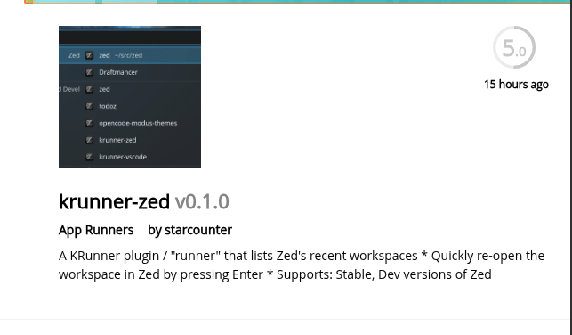
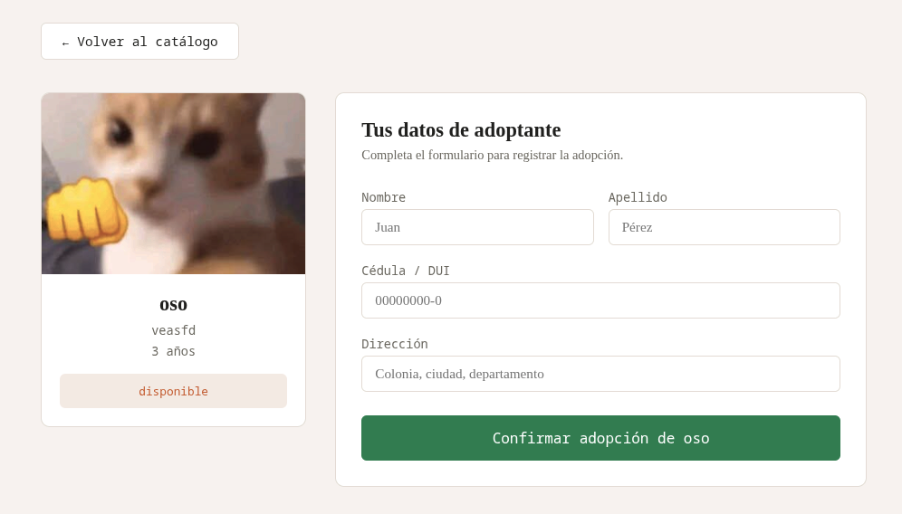
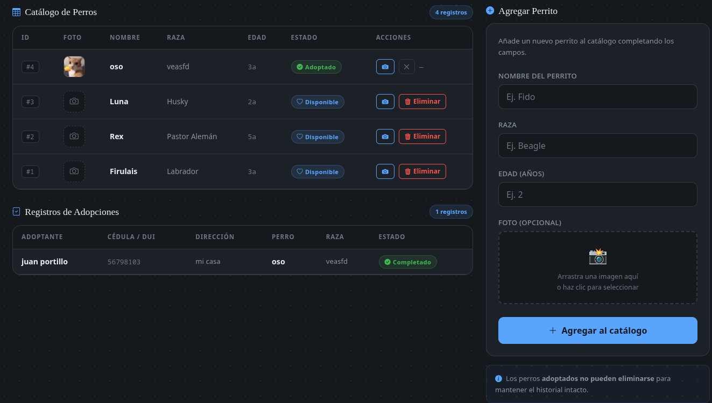

Levantar entorno con docker

ubuntu

# 1. Instalar dependencias del sistema
sudo apt update
sudo apt install docker.io docker-compose python3 python3-pip python3-venv libmariadb-dev

# 2. Habilitar Docker
sudo systemctl enable --now docker

# 3. Clonar el repo
git clone url del repositorio
cd CentroAdopcion

# 4. Levantar MariaDB
sudo docker compose up -d

# 5. Crear venv e instalar dependencias
python3 -m venv venv
source venv/bin/activate
pip install -r requirements.txt

# 6. Crear las tablas
python3 setup_db.py

# 7. Correr la app
python3 main.py

Preview de la app

